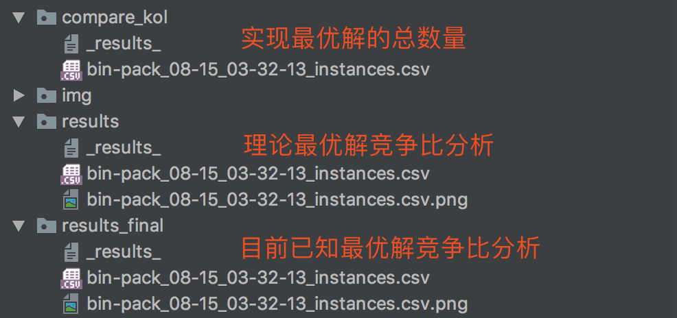

# Binpacking 

#### * Python3
#### 1. Algorithm
 > 非降序算法，在线启发式算法 next\_fit,first\_fit,worst\_fit,almost\_worst_fit,best\_fit
 > 降序算法，离线启发式算法 next\_fit,first\_fit,worst\_fit,almost\_worst_fit,best\_fit
 > MBS, MBS', AMBS, IAMBS
 
#### 2. 目录结构
 
```
├── README.md
├── __pycache__
├── _backup					# 历史备份
├── add_knownSOL.py			# 增加已知最优解到最终结果
├── analysis.py				# 分析平均竞争比和平均运行时间
├── benchmark				# 数据集的目前已知最优解集
│   ├── SCH_WAE_KOS.csv
│   ├── WAE_GAU_KOS.csv		# ！！！！！！这部分经验证是错误的已知最优解
│   ├── bin1data_KOS.csv
│   ├── bin2data_KOS.csv
│   ├── bin3data_KOS.csv
│   ├── instances_KOS.csv
│   └── ragion_formal		# 已知最优解数据集原文件
├── bin_pack.py				# 装箱算法
├── bin_pack_main_AMBS.py	# 主程序
├── binary_tree.py			# 平衡二叉树
├── binpacking_data_set		# 数据集
│   ├── bin1data
│   ├── bin2data
│   ├── bin3data
│   ├── hard28
│   ├── instances
│   ├── schwerin
│   ├── test_set			# 测试数据集
│   └── waescher
├── compare_kol				# 实验结果----对比实现已知最优解的数量
│   ├── _results_
│   └── bin-pack_08-15_03-02-01_instances.csv
├── compare_result.py		# 对比实现已知最优解的数量
├── results					# 实验结果----理论竞争比
│   ├── _results_
│   ├── bin-pack_08-15_03-02-01_instances.csv
│   └── bin-pack_08-15_03-02-01_instances.csv.png
├── results_final			# 实验结果----已知最优解竞争比

│   ├── bin-pack_08-15_03-02-01_instances.csv
│   └── bin-pack_08-15_03-02-01_instances.csv.png
```

#### 3. 程序运行
##### - 选择要运行的程序
```
bin_pack.py
```
非降序算法和降序算法不要在同一次试验中同时运行，因为算法名称相同，后期数据分析会吧结果混掉。
现有的数据集默认降序排列，所有建议只运行降序算法

##### - 运行主程序
```
bin_pack_main_AMBS.py

```


##### - 试验结果



